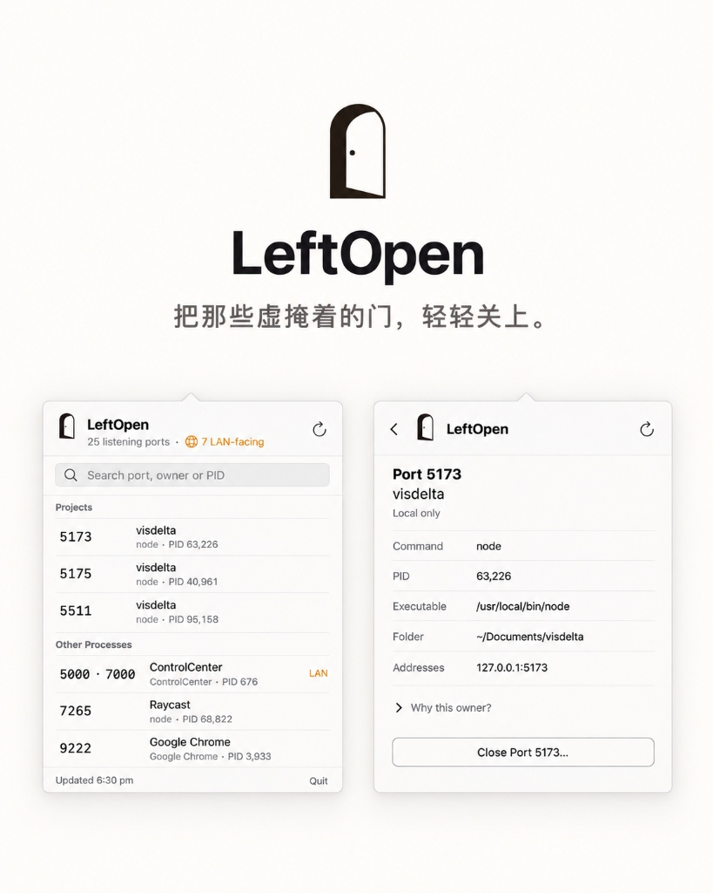

<div align="center">
  
  <h1>LeftOpen</h1>
  <p>把那些虚掩着的门，轻轻关上。</p>
  <p><em>See what your tools left running on localhost, and gently close them.</em></p>

  <p>
    <a href="https://songhaifan.github.io/leftopen/"></a>
    <a href="https://github.com/SonghaiFan/leftopen/releases/latest"></a>
    <a href="https://github.com/SonghaiFan/homebrew-tap"></a>
    
    
    <a href="LICENSE"></a>
  </p>

  <br />
  
  <br /><br />
</div>

> 当我并行让多个 agent 写代码时，开发服务器和测试服务会不断启动，监听不同的端口。忙完一天，电脑里往往留下不少还开着的服务。
>
> 现有工具要么太复杂，要么只能告诉你“端口被占用”，却说不清它到底属于哪个进程、可能来自哪个项目。
>
> 所以我做了 **LeftOpen**。它安静地待在菜单栏里，帮你一眼看清正在监听的端口、对应的进程，以及可能关联的项目。确认之后，你可以关闭那些不再需要的服务。
>
> *把那些虚掩着的门，轻轻关上。*

---

## 安装 (Installation)

### Homebrew (推荐)

```bash
brew install --cask songhaifan/tap/leftopen
```

已通过 Apple 官方公证（Notarized），在 macOS Sonoma (14.0+) 上下载即可直接打开。

### 手动下载

前往 [GitHub Releases](https://github.com/SonghaiFan/leftopen/releases/latest) 下载 `LeftOpen.zip`，解压后将 `LeftOpen.app` 移至 `/Applications`。

---

## 核心设计 (Design & Features)

- **工程归属推断**：解析 `.git`、`package.json`、`pyproject.toml`、`Cargo.toml`、`go.mod` 与 `.app` 真实目录，不再显示无意义的 `node` 或 `python`。
- **克制温和关闭**：关闭前显示关联端口预览；关闭瞬间校验 PID 与启动时间防误杀；仅发送 `SIGTERM` 礼貌退出，绝不擅自 `SIGKILL`，拒绝越权关闭系统进程。
- **LAN 暴露区分**：自动标识端口是仅绑定回环地址（`127.0.0.1`），还是向局域网公开（`0.0.0.0` / LAN IP）。
- **零后台常驻**：纯原生 SwiftUI `MenuBarExtra`。无守护进程，无 Dock 栏图标，无网络遥测，打开即用。
- **终端 CLI 支持**：内置零外部依赖的 TypeScript 命令行工具。

---

## 命令行 (CLI)

```bash
# 扫描当前端口与归属
npm start

# 查看指定端口
npm start -- 3000

# 结构化 JSON 输出
npm start -- --json

# 交互式安全关闭端口（默认 No）
npm start -- close 3000
```

全局链接：
```bash
npm link
leftopen
leftopen 3000
```

CLI 输出示例：
```text
LEFT OPEN
26 listening ports · 17 processes · 1 projects · 8 LAN-visible

MY PROJECTS (2)
PORT    PID      OWNER          PROCESS    SCOPE
5173    76344    visdelta       node       LOCAL
         ↳ ~/Documents/visdelta
5511    4999     visdelta       node       LOCAL
         ↳ ~/Documents/visdelta

APPLICATIONS (16)
PORT    PID      OWNER          PROCESS    SCOPE
5000    696      ControlCenter  Control    LAN
9222    36824    Google Chrome  Chrome     LOCAL

LOCAL = this Mac only · LAN = may be reachable from your local network
```

---

## 构建与测试 (Development)

```bash
# 运行原生测试
swift test

# 运行 CLI 测试
npm test

# 本地编译 App
LEFTOPEN_OUTPUT_DIR=dist/dev Scripts/build-app.sh
```

---

## 许可证 (License)

[MIT License](LICENSE)
