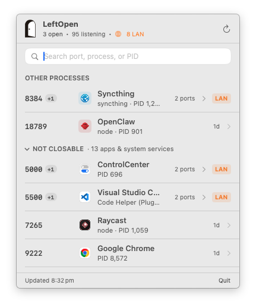

<div align="center">
  
  <h1>LeftOpen</h1>
  <p>把那些虚掩着的门，轻轻关上。</p>
  <p><em>See what your tools left running on localhost, and gently close them.</em></p>

  <p>
    <a href="https://songhaifan.github.io/leftopen/"></a>
    <a href="https://github.com/SonghaiFan/leftopen/releases/latest"></a>
    <a href="https://github.com/SonghaiFan/homebrew-tap"></a>
    
    
    <a href="LICENSE"></a>
  </p>

  <p><a href="README.md">English</a> · <strong>中文</strong></p>

  <br />
  <picture>
    <source srcset="assets/preview-dark.png" media="(prefers-color-scheme: dark)">
    
  </picture>
  <br /><br />
</div>

> 当我并行让多个 agent 写代码时，开发服务器和测试服务会不断启动，监听不同的端口。忙完一天，电脑里往往留下不少还开着的服务。
>
> 现有工具要么太复杂，要么只能告诉你“端口被占用”，却说不清它到底属于哪个进程、可能来自哪个项目。
>
> 所以我做了 **LeftOpen**。它安静地待在菜单栏里，帮你一眼看清正在监听的端口、对应的进程，以及可能关联的项目。确认之后，你可以关闭那些不再需要的服务。
>
> *把那些虚掩着的门，轻轻关上。*

---

## 安装

### Homebrew（推荐）

```bash
brew install --cask songhaifan/tap/leftopen
```

由 Apple Developer ID 签名并经 Apple 公证，在 macOS Sonoma (14.0+) 上下载即可直接打开。

### 手动下载

前往 [GitHub Releases](https://github.com/SonghaiFan/leftopen/releases/latest) 下载 `LeftOpen.zip`，解压后将 `LeftOpen.app` 移至「应用程序」。

---

## 核心设计

- **知道端口是谁的。** 从进程的工作目录向上找 `.git`、`package.json`、`pyproject.toml`、`Cargo.toml`、`go.mod`，或者解析它所属的 `.app`。全局 npm 包、`python -m` 模块和 Redis / Postgres / Ollama 这类独立服务也按名字识别，很少再看到一个光秃秃的 `node` 或 `python`。
- **真实图标，不预存。** 有 `.app` 就用它的图标；否则用项目或包自己带的（Tauri / Electron app icon、`index.html` 声明的 favicon、`public/` 约定）；否则向本机服务器抓 favicon；再没有才用符号。
- **先看该关的。** 可关闭的端口排在前面，app 和系统服务折叠收起。菜单栏图标是一扇开着或关着的门，每一行都标着进程已经跑了多久。
- **关得轻。** 确认前先列出同一进程的其他端口；关闭瞬间重新核对 PID 与启动时间；只发 `SIGTERM`。不 `SIGKILL`，不碰系统进程。
- **本机还是局域网。** 区分绑在 `127.0.0.1` 的端口和绑在 `0.0.0.0` / 局域网地址上的端口。
- **没有后台常驻。** 原生 SwiftUI `MenuBarExtra`。无守护进程，无 Dock 图标，无遥测。
- **终端里是同一个引擎。** App 附带 `leftopen` 命令行工具，推断和安全规则完全一致。

---

## 命令行

安装后即可在终端直接运行：

```bash
# 查看所有监听端口与归属（或 leftopen list）
leftopen

# 查看指定端口详情
leftopen 3000

# 在默认浏览器打开 http://localhost:3000
leftopen open 3000

# 安全关闭指定端口（SIGTERM，先确认）
leftopen close 3000

# 结构化 JSON 输出
leftopen --json
```

输出示例：
```text
LEFT OPEN
26 listening ports · 17 processes · 1 projects · 8 LAN-visible

MY PROJECTS (2)
PORT    PID      OWNER          PROCESS    AGE      SCOPE
5173    76344    visdelta       node       2h       LOCAL
         ↳ ~/Documents/visdelta
5511    4999     visdelta       node       27m      LOCAL
         ↳ ~/Documents/visdelta

APPLICATIONS (16)
PORT    PID      OWNER          PROCESS    AGE      SCOPE
5000    696      ControlCenter  Control    3d       LAN
9222    36824    Google Chrome  Chrome     5h       LOCAL

SERVICES (3)
PORT    PID      OWNER          PROCESS    AGE      SCOPE
11434   911      Ollama         ollama     1d       LOCAL

LOCAL = this Mac only · LAN = may be reachable from your local network
```

---

## 构建与测试

```bash
# 运行原生测试
swift test

# 运行 CLI 原型测试
npm test

# 本地编译 App
LEFTOPEN_OUTPUT_DIR=dist/dev Scripts/build-app.sh
```

---

## 许可证

[MIT License](LICENSE)
