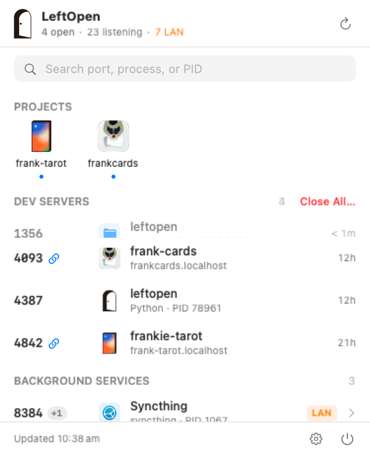

<div align="center">
  
  <h1>LeftOpen</h1>
  <p><strong>原生 macOS 菜单栏端口管理工具与 CLI</strong></p>
  <p>把那些虚掩着的门，轻轻关上。</p>
  <p><em>See what your tools left running on localhost, identify projects, and gently close them.</em></p>

  <p>
    <a href="https://leftopen.songhai.site/"></a>
    <a href="https://github.com/SonghaiFan/leftopen/releases/latest"></a>
    <a href="https://github.com/SonghaiFan/homebrew-tap"></a>
    
    
    <a href="LICENSE"></a>
  </p>

  <p><a href="README.md">English</a> · <strong>中文</strong></p>

  <br />
  <picture>
    <source srcset="assets/preview-dark.png" media="(prefers-color-scheme: dark)">
    
  </picture>
  <br /><br />
</div>

> 当我并行让多个 agent 写代码时，开发服务器和测试服务会不断启动，监听不同的端口。忙完一天，电脑里往往留下不少还开着的服务。
>
> 现有工具要么太复杂，要么只能告诉你“端口被占用”，却说不清它到底属于哪个进程、可能来自哪个项目。
>
> 所以我做了 **LeftOpen**。它安静地待在菜单栏里，帮你一眼看清正在监听的端口、对应的进程，以及可能关联的项目。确认之后，你可以关闭那些不再需要的服务。
>
> *把那些虚掩着的门，轻轻关上。*

---

## 安装

### Homebrew（推荐）

```bash
brew install --cask songhaifan/tap/leftopen
```

支持运行 macOS Sonoma (14.0+) 的 Apple Silicon 和 Intel Mac。App 与附带的 CLI 均为通用二进制，由 Apple Developer ID 签名并经 Apple 公证。

### 手动下载

前往 [GitHub Releases](https://github.com/SonghaiFan/leftopen/releases/latest) 下载 `LeftOpen-release.zip`，解压后将 `LeftOpen.app` 移至「应用程序」。

---

## 核心设计

- **知道端口是谁的。** 从进程的工作目录向上找 `.git`、`package.json`、`pyproject.toml`、`Cargo.toml`、`go.mod`，或者解析它所属的 `.app`。全局 npm 包、`python -m` 模块和 Redis / Postgres / Ollama 这类独立服务也按名字识别，很少再看到一个光秃秃的 `node` 或 `python`。
- **真实图标，不预存。** 有 `.app` 就用它的图标；否则用项目或包自己带的（Tauri / Electron app icon、`index.html` 声明的 favicon、`public/` 约定）；否则向本机服务器抓 favicon；再没有才用符号。
- **按来历分组。** 开发服务器（从项目、终端、编辑器或 agent 启动）、后台服务（由 launchd 管理：brew services、登录项）、App 和系统。分组即关闭方式，每组都写明：开发服务器发 SIGTERM，launchd 会重启的服务提示 `brew services stop …`，App 的端口需要退出 App。
- **先轻轻关闭。** 发送 `SIGTERM`，关闭前重新核对进程身份。单独关闭一个进程后等待五秒，如果仍在监听，该进程会显示失败提示；警告会说明两分钟内再次点击或右滑关闭将发送 `SIGKILL`。第二次关闭操作就是明确的强制关闭，原有安全保护和身份核验仍然生效。
- **本机还是局域网。** 区分绑在 `127.0.0.1` 的端口和绑在 `0.0.0.0` / 局域网地址上的端口。
- **没有后台常驻。** 原生 SwiftUI `MenuBarExtra`。无守护进程，无 Dock 图标，无遥测。唯一离开这台 Mac 的网络请求是每天向 GitHub 查询一次最新版本，可在设置中关闭。
- **终端里是同一个引擎。** App 附带 `leftopen` 命令行工具，推断和安全规则完全一致。

---

## 为什么选择 LeftOpen？（解决的核心痛点）

- **解决端口被占用问题（`EADDRINUSE` / Port in use）**：开发服务启动失败提示端口 3000、5173 或 8080 被占用时，LeftOpen 让你在菜单栏或终端快速定位残留进程并一键关闭，无需重启终端或 Mac。
- **定位真实项目，告别模糊的 `node` / `python` PID**：`lsof -i` 和普通端口清理脚本只能提供裸 PID 或进程名。LeftOpen 自动向上追溯工作目录（识别 `package.json`、`Cargo.toml`、`pyproject.toml`、`go.mod`、`.git` 等），显示真实项目名称与应用图标。
- **发现意外的局域网暴露（LAN Exposure）**：清晰区分仅本机可见（`127.0.0.1`）与暴露在局域网（`0.0.0.0` / 网卡 IP）的服务，防止本地开发或测试数据库在公共 Wi-Fi 中无意公开。
- **先给进程正常退出的机会**：优先发送 `SIGTERM`，让服务运行清理钩子与保存状态；仍未停止时，再次点击或右滑关闭会强制结束，同时重新核验 PID、启动时间和受影响端口。

---

## 命令行

安装后即可在终端直接运行：

```bash
# 查看所有监听端口与归属（或 leftopen list）
leftopen

# 查看指定端口详情
leftopen 3000

# 在默认浏览器打开 http://localhost:3000
leftopen open 3000

# 安全关闭指定端口（SIGTERM，先确认）
leftopen close 3000

# 结构化 JSON 输出
leftopen --json
```

输出示例：
```text
LEFT OPEN
26 listening ports · 17 processes · 1 projects · 8 LAN-visible

MY PROJECTS (2)
PORT    PID      OWNER          PROCESS    AGE      SCOPE
5173    76344    visdelta       node       2h       LOCAL
         ↳ ~/Documents/visdelta
5511    4999     visdelta       node       27m      LOCAL
         ↳ ~/Documents/visdelta

APPLICATIONS (16)
PORT    PID      OWNER          PROCESS    AGE      SCOPE
5000    696      ControlCenter  Control    3d       LAN
9222    36824    Google Chrome  Chrome     5h       LOCAL

SERVICES (3)
PORT    PID      OWNER          PROCESS    AGE      SCOPE
11434   911      Ollama         ollama     1d       LOCAL

LOCAL = this Mac only · LAN = may be reachable from your local network
```

---

## 构建与测试

```bash
# 运行测试
swift test

# 本地编译 App
LEFTOPEN_OUTPUT_DIR=dist/dev Scripts/build-app.sh
```

---

## 许可证

[MIT License](LICENSE)


## 固定项目地址

先在 **设置 → 项目 → 本地项目地址 → 完成首次设置** 集中完成授权，再照常启动项目，在端口详情点击 **启用固定地址**。LeftOpen 内置 Portless 和 Node，无需另外安装 Portless 或使用终端。新地址为 `https://myapp.localhost`。设置页说明授权用途：通过 macOS 系统授权信任本地 CA、安装只监听本机的 443 地址服务，并管理精确的 hosts 条目；后续项目直接复用，不再重复授权。只有设置页的首次设置或修复按钮会触发授权。项目操作在需要时引导至设置，后台扫描不会弹出授权。macOS 可能在这轮首次设置中分别显示管理员和证书信任两个窗口。

已有 HTTP 地址继续可用，可在 **设置 → 项目 → 本地项目地址** 完成 HTTPS 升级。对于扫描到的服务，请保持 LeftOpen 运行：映射有短期有效时间，扫描停止后失效，下次打开 App 恢复。停用地址不会停止项目。HTTPS 后台服务在退出 App 后仍保留；由 Portless 启动的项目按其自身生命周期运行。443 被其他服务占用时显示原因，不抢占服务。外部 Portless 的状态目录与服务标识独立保留。

已保存项目停止后显示 **未运行**，有现成开发脚本时提供 **启动**。直接使用 Portless 原有的启动能力：分配空闲端口、适配开发框架、读取项目配置、区分 worktree 和发现 workspace 服务。不从进程参数猜启动命令，不修改项目文件。没有配置脚本的项目显示 **打开项目**；项目自身依赖的运行时与包管理器仍需存在。

LeftOpen 根据项目目录、可执行文件、工作目录、参数摘要与当前监听进程确认映射。服务停止、归属不明确或无关进程占用端口时不转发。不支持仅 HTTPS 的上游服务或非 Web 端口。开发服务器拒绝新主机名时在详情内显示原因，不自动修改配置。

Agent 与脚本可以用 `leftopen url [名称|端口|路径]` 查询实时确认的地址，加 `--json` 获取结构化结果。`leftopen --json` 为对应服务增加 `fixedURL`。App 与 CLI 共用有时效的地址目录，CLI 会再次核对当前进程。外部 Portless 地址仍可在「地址选项」查看。

App 包含 Portless 0.15.7（Apache-2.0）和 Node 24.14.0 及对应许可证。构建校验固定下载摘要，包含两种 Mac 架构；发布签名同时为内置 Node 添加 JIT entitlement。

[Portless 文档](https://github.com/vercel-labs/portless)
